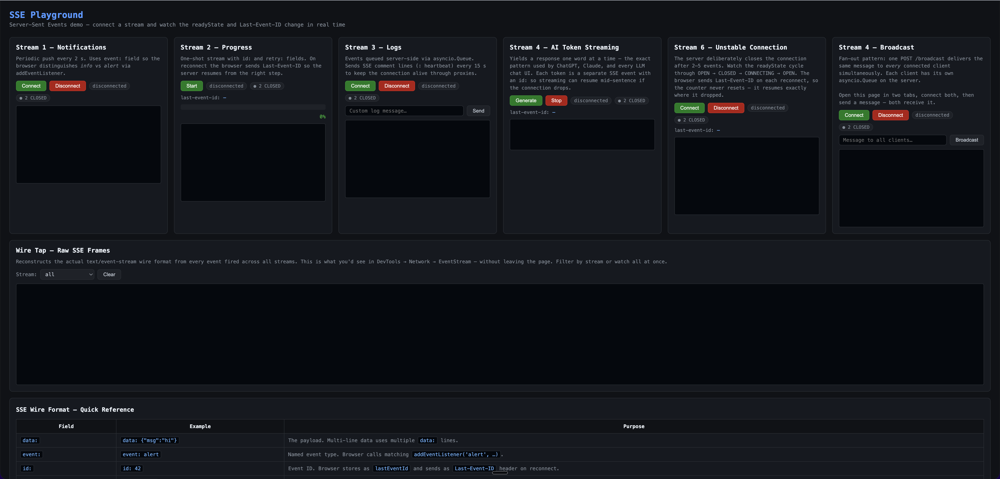

# SSE Playground

> A hands-on project for learning **Server-Sent Events (SSE)** — the simplest way to push real-time data from a server to a browser.

[](https://github.com/fellipegpbotelho/sse-playground/actions/workflows/ci.yml)


Built with **FastAPI** + **vanilla JavaScript**. No frontend framework, no build step — so you can focus entirely on SSE.



---

## What you will learn

| | Concept |
|---|---|
| 📡 | What SSE is and how it differs from WebSockets and polling |
| 🔌 | The raw wire format — `data:`, `event:`, `id:`, `retry:` |
| 🌐 | How the browser `EventSource` API works |
| 🐍 | How to implement SSE streams in FastAPI with async generators |
| 🔄 | Auto-reconnect and the `Last-Event-ID` mechanism |
| 📬 | How to push events on demand via a server-side queue |

---

## Quickstart

```bash
git clone https://github.com/fellipegpbotelho/sse-playground
cd sse-playground
uv sync
make dev
```

Open [http://localhost:8000](http://localhost:8000).

> **Tip:** DevTools → Network → click any `/stream/*` request → **EventStream** tab to see the raw frames as they arrive.

Or run with Docker:

```bash
make docker-build
make docker-run
```

---

## How it works

A single HTTP `GET` — the server keeps writing `data: …\n\n` lines, and the browser fires a JS event for each one.

```
Browser                              FastAPI
   │                                    │
   │──── GET /stream/notifications ────►│
   │                                    │  async generator, runs forever
   │◄─── event: info                    │
   │     data: {"msg":"System healthy"} │  yields every 2 s
   │                                    │
   │◄─── event: alert                   │
   │     data: {"msg":"High CPU!"}      │
   │                                    │
   │──── GET /stream/progress ─────────►│
   │◄─── id: 0 / data: {"pct": 0}      │  yields 10 steps, then closes
   │◄─── id: 1 / data: {"pct": 10}     │
   │                                    │
   │──── GET /stream/logs ─────────────►│
   │◄─── data: {"msg":"connected"}      │  reads from asyncio.Queue
   │                                    │
   │──── POST /trigger-log ────────────►│  you push a message
   │◄─── data: {"msg":"your message"}   │  stream delivers it live
```

---

## The three streams

### 1 · Notifications — named events

`GET /stream/notifications`

Pushes an event every 2 s. Uses the `event:` field so the browser can distinguish event types with `addEventListener` instead of the generic `onmessage`.

```
event: info
data: {"id": 0, "message": "System healthy", "timestamp": "..."}

event: alert
data: {"id": 2, "message": "High memory usage detected!", "timestamp": "..."}
```

```js
source.addEventListener('info',  (e) => { /* only info events  */ })
source.addEventListener('alert', (e) => { /* only alert events */ })
```

---

### 2 · Progress — `id:` and `retry:`

`GET /stream/progress`

Yields 10 steps then closes. Demonstrates two underused SSE fields:

- **`id:`** — the browser stores this as `lastEventId` and sends it as a `Last-Event-ID` request header on reconnect, so the server can resume from the right step.
- **`retry:`** — overrides the browser's reconnect delay (default ~3 s).

```
id: 3
retry: 3000
data: {"step": 3, "percent": 30, "done": false}
```

---

### 3 · Logs — server-side queue + heartbeat

`GET /stream/logs`

Events are queued in an `asyncio.Queue`. A separate `POST /trigger-log` writes into it; the open stream delivers the entry immediately. Also sends SSE **comment lines** every 15 s to prevent proxies from closing the idle connection.

```
: heartbeat

data: {"level": "MANUAL", "msg": "Hello from the browser!", "ts": "..."}
```

---

## SSE wire format

Events are plain text separated by a **blank line** (`\n\n`). The content-type must be `text/event-stream`.

| Field | Example | What it does |
|---|---|---|
| `data:` | `data: {"msg":"hi"}` | The payload. Repeat the field for multi-line values. |
| `event:` | `event: alert` | Names the event. Browser routes it to `addEventListener('alert', …)`. |
| `id:` | `id: 42` | Bookmarks the stream. Browser sends it as `Last-Event-ID` on reconnect. |
| `retry:` | `retry: 3000` | Sets the browser reconnect delay in ms. |
| `: comment` | `: heartbeat` | Ignored by browser; resets proxy idle timers. |

---

## SSE vs WebSockets vs Polling

| | SSE | WebSockets | Polling |
|---|:---:|:---:|:---:|
| Direction | Server → Client | Bidirectional | Client pulls |
| Protocol | HTTP | Upgraded TCP (`ws://`) | HTTP |
| Auto-reconnect | ✅ Built-in | ❌ Manual | — |
| Binary support | ❌ Text only | ✅ | ✅ |
| Proxy friendly | ✅ | ⚠️ Sometimes blocked | ✅ |
| Complexity | Low | Medium | Low |

**Use SSE** when the server pushes and the client only listens — notifications, progress bars, log tailing, AI token streaming.

**Use WebSockets** when you need bidirectional real-time communication — chat, multiplayer games, collaborative editing.

---

## Key concepts in code

**Server — async generator**

```python
@app.get("/stream/example")
async def stream(request: Request):
    async def generator():
        while True:
            if await request.is_disconnected():
                break                           # clean up when tab closes
            yield {"event": "ping", "data": "hello"}
            await asyncio.sleep(1)              # must await to release the event loop

    return EventSourceResponse(generator())
```

**Browser — EventSource API**

```js
const source = new EventSource('/stream/example')

source.onmessage = (e) => console.log(e.data)               // unnamed events
source.addEventListener('ping', (e) => console.log(e.data)) // named events
source.onerror = () => console.log('dropped — will retry automatically')
source.close()                                               // manual disconnect
```

---

## License

MIT
